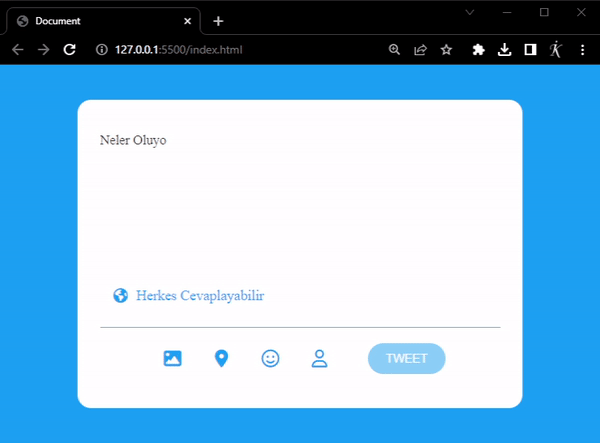

# Twitter Card Javascript Project 

 Bu projede JS yapısı kullanarak öncelikle harf giriş denetimi sağladık.  Harf giriş sayımızı sınırladık. 
 

 Ayrıca Tweet atma koşulumuzu harf girişi yapılınca ve harf sınırı aşılmadığı sürece tweet atılabilir olarak belirledik. 

 Son olarak da harf sınırı geçilince, fazla yazılan her harfin arka plan rengini  kırmızı yaptık ve bunu aşağıdaki sayaca da yansıttık. 

 -------------   -------------    -------------

 In this project, we used the JavaScript structure to implement letter input control. We limited the number of letter inputs. 

 Additionally, we set our condition for tweeting to be possible when letter input is made and the letter limit is not exceeded. 

Proje Görüntüsü / Project View 

